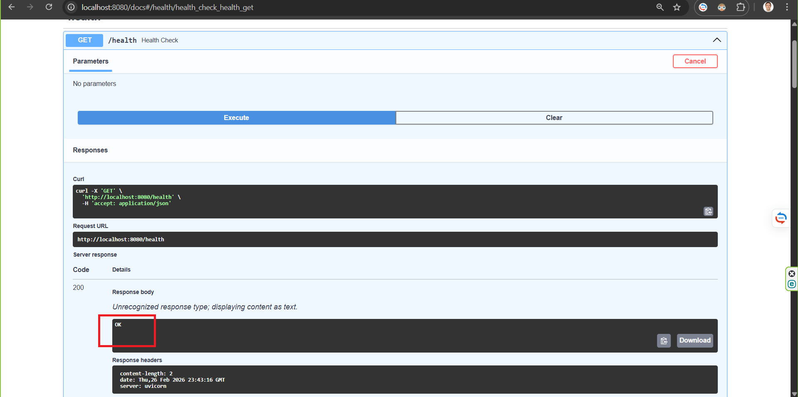
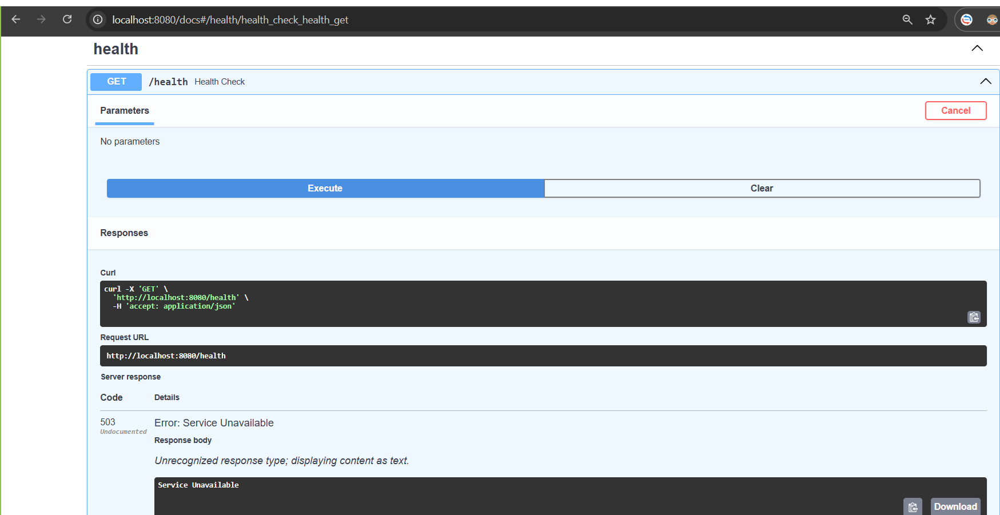
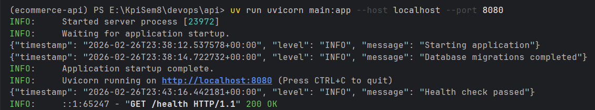
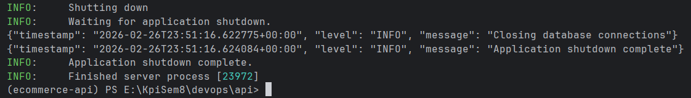
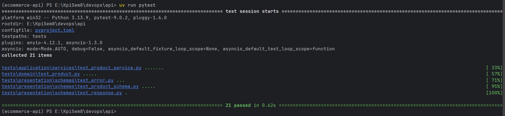

# Лабораторна робота №0: Підготовка застосунку — Readiness & Standardization

## Налаштування

### Змінні оточення

| Змінна | Опис | Приклад |
|--------|------|---------|
| `DB_HOST` | Хост бази даних | `localhost` |
| `DB_PORT` | Порт бази даних | `5433` |
| `DB_NAME` | Назва бази даних | `ecommerce` |
| `DB_USER` | Користувач БД | `postgres` |
| `DB_PASSWORD` | Пароль БД | `postgres` |

### Запуск

```bash
# Встановлення залежностей
uv sync --all-extras

# Запуск тестів (без БД)
uv run pytest

# Запуск застосунку (потребує PostgreSQL)
uv run uvicorn main:app --host localhost --port 8080
```

---

## Фаза 1: Обов'язкові вимоги

### 1. One-Command Build
- Файл залежностей: `pyproject.toml`
- Команда тестів: `uv run pytest`

### 2. Конфігурація через ENV
Всі налаштування зчитуються зі змінних оточення через `pydantic-settings`.

### 3. Автоматичні міграції
Alembic міграції застосовуються автоматично при запуску застосунку.

---

## Фаза 2: Production-Grade фічі

### 1. Health Check

**200 OK** (БД доступна):



**503 Service Unavailable** (БД недоступна):



---

### 2. JSON Logging

Приклад логів при запуску:



---

### 3. Graceful Shutdown

Після надсилання `SIGTERM` (Ctrl+C):



---

### 4. Тестування

Результат виконання тестів:



---